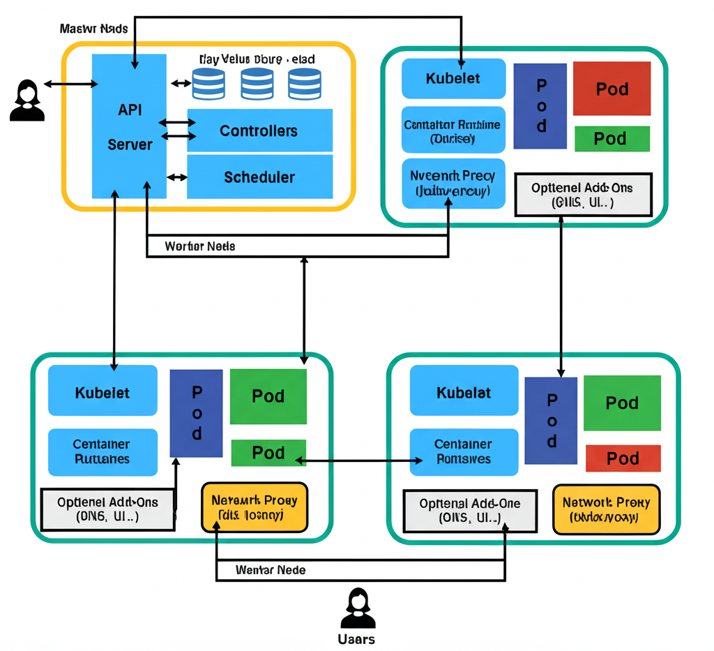

# Kubernetes Architecture

## 1. Introduction

### What is Kubernetes?
Kubernetes (often abbreviated as **K8s**) is an open-source container orchestration platform that automates the deployment, scaling, and management of containerized applications.

### Why use Kubernetes?
Kubernetes simplifies application management in dynamic environments, allowing teams to run applications reliably across multiple environments—on-premises, cloud, or hybrid.

### Key benefits & use cases
- **Scalability** – Automatically scale applications up or down.
- **High availability** – Minimize downtime with self-healing mechanisms.
- **Portability** – Run workloads across different cloud providers or on-premises.
- **Efficient resource utilization** – Schedule workloads effectively.

---

## 2. High-Level Architecture

Kubernetes architecture is split into two major parts:

- **Control Plane** – Manages the cluster, makes global decisions, and monitors cluster state.
- **Worker Nodes** – Run the workloads (containers) as scheduled by the control plane.

### Cluster Components Overview Diagram

---

## 3. Control Plane Components

### 3.1 kube-apiserver
- Acts as the **front door** to the cluster.
- Handles REST requests (via `kubectl`, client libraries, or API calls).
- Validates and processes requests, then updates the cluster state in `etcd`.

### 3.2 etcd
- Distributed **key-value store** for cluster data.
- Stores **desired state** and configuration.
- **Backup is critical** to recover from data loss or corruption.

### 3.3 kube-scheduler
- Decides where pods will run.
- Considers **resource requirements**, **taints/tolerations**, **node affinity**, and **workload spread**.

### 3.4 kube-controller-manager
- Runs various **controllers**:
  - **Node Controller** – Monitors node health.
  - **Replication Controller** – Ensures desired pod counts.
  - **Endpoints Controller** – Manages service endpoints.

### 3.5 cloud-controller-manager
- Integrates Kubernetes with cloud provider APIs.
- Manages:
  - Load balancers
  - Persistent storage volumes
  - Networking routes

---

## 4. Worker Node Components

### 4.1 kubelet
- Communicates with the API server.
- Ensures containers described in PodSpecs are running.
- Handles **Pod lifecycle management**.

### 4.2 kube-proxy
- Manages networking for services.
- Implements **iptables** or **IPVS** rules for routing traffic to pods.

### 4.3 Container Runtime
- Executes containers based on Kubernetes instructions.
- Must be **CRI-compatible**.
- Examples: **containerd**, **CRI-O**, **Docker** (deprecated in newer Kubernetes versions).

---

## 5. Add-ons
- **CoreDNS** – DNS for service discovery.
- **Ingress Controllers** – HTTP/HTTPS routing into the cluster.
- **Metrics Server** – Resource usage data for autoscaling.
- **CNI Plugins** – Networking providers (Calico, Flannel, Cilium).

---

## 6. Networking in Kubernetes
- **Pod-to-pod communication** – Flat network space.
- **Service Types**:
  - `ClusterIP` – Internal cluster access.
  - `NodePort` – External access via node IP.
  - `LoadBalancer` – External access via cloud load balancers.
- **Network Policies** – Restrict or allow communication between pods.

---

## 7. Storage in Kubernetes
- **Volumes** – Ephemeral or persistent.
- **Persistent Volumes (PV)** – Cluster-level storage resources.
- **StorageClasses** – Enable **dynamic provisioning** from storage providers.

---

## 8. Security Considerations
- **RBAC** – Role-based access control for API resources.
- **Service Accounts & Secrets** – Secure authentication and configuration storage.
- **Network Policies** – Enforce communication rules between pods.
- **Pod Security Standards (PSS)** – Define security requirements for workloads.

---

## 9. Cluster Lifecycle
- **Bootstrapping** – Initial setup of control plane and worker nodes.
- **Scaling** – Add/remove nodes or scale workloads.
- **Upgrades & Maintenance** – Apply security patches and new features without downtime.

---

## 10. Conclusion
Kubernetes provides a **scalable, resilient, and flexible** platform for running containerized applications.  
It continues to evolve, with trends like:
- **Serverless Kubernetes**
- **Edge computing integration**
- **AI/ML workload optimization**

---
